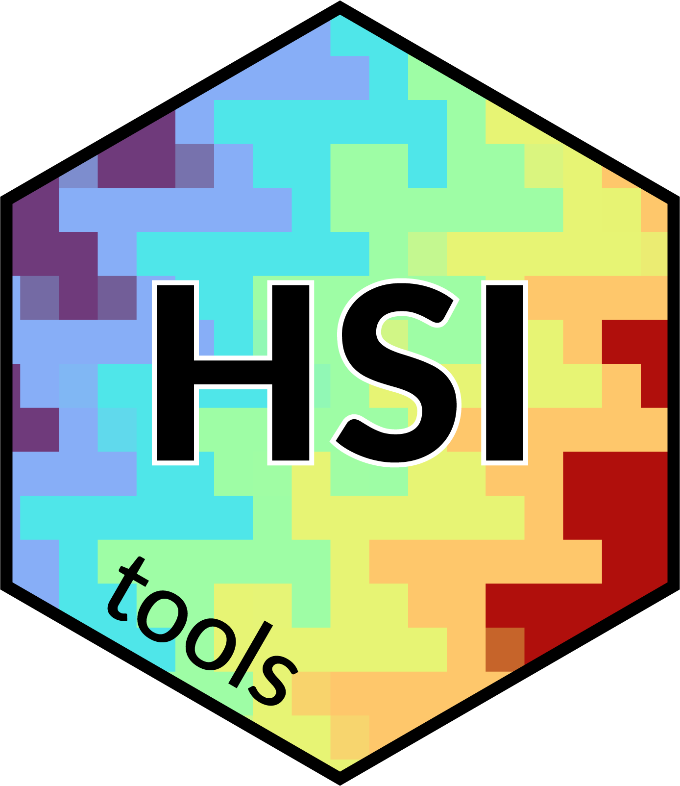

<!-- README.md is generated from README.Rmd. Please edit that file -->

```{r, include = FALSE}
knitr::opts_chunk$set(
  collapse = TRUE,
  comment = "#>",
  fig.path = "man/figures/README-",
  out.width = "100%"
)
```

# HSItools

<!-- badges: start -->

[](https://github.com/mzarowka/HSItools/actions/workflows/R-CMD-check.yaml)

<!-- badges: end -->

HSItools is an R package to process and visualize hyperspectral core scanning data.{width="150"}

## Installation

You can install the development version of HSItools like so:

``` r
# install.packages("pak")

# pak::pak("mzarowka/HSItools)
```

## Example

The basic workflow includes running the shiny app to choose analysis options and visually interact with the core image. After this, reflectance is calculated and all subsequent operations use reflectance or its subsets.

```{r example, include=TRUE, eval=FALSE}
library(HSItools)

# Run shiny app and store results for further processing
core <- run_core()

# Get reflectance, normalize the capture
reflectance <- core |>
  prepare_core()

# Create RGB preview and write to file
rgb_preview <- reflectance |>
  stretch_raster_full(reflectance, ext = "tif", write = TRUE)

# Plot RGB preview
rgb_plot <- reflectance |>
  plot_raster_rgb(reflectance)
```

Maurycy Żarczyński is founded by the Polish National Agency for Academic Exchange (BPN/BEK/2021/1/00133).

{width="192"}
