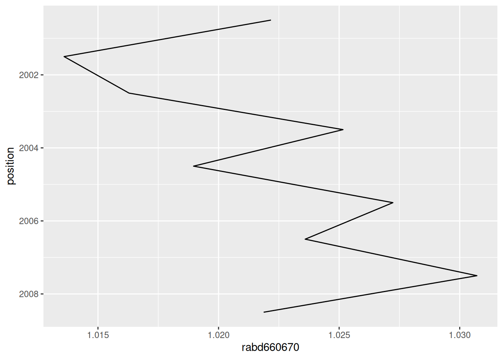
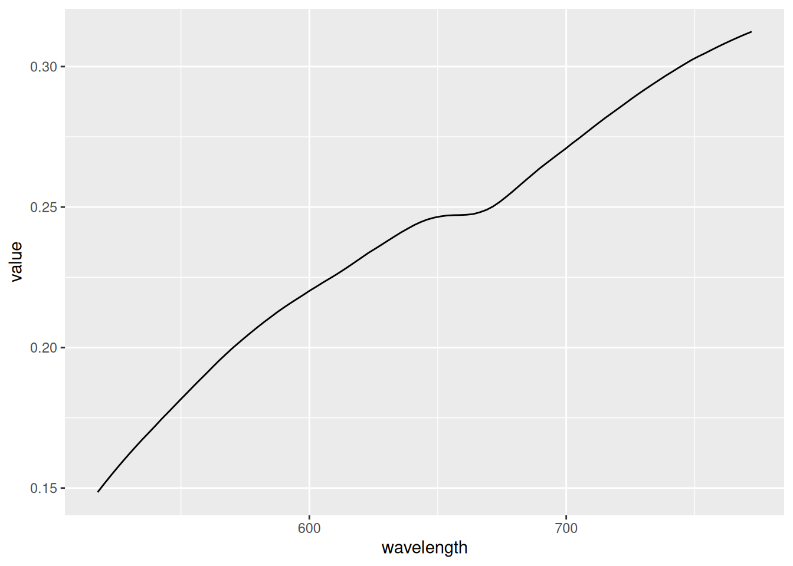

# Spectral indices

``` r

library(HSItools)
```

## Spectral indices catalogue

HSItools includes a built-in catalogue of spectral indices drawn from
the literature. It is a practical starting point for common sediment
proxies, not a comprehensive literature review.

``` r

# Show tibble
HSItools::spectral_indices
#>        proxy_name proxy_type continuum_edges absorption_band index_type
#> 1         rabd510       rabd        590, 730             510     strict
#> 2         rabd615       rabd        590, 730             615     strict
#> 3  rabd615_narrow       rabd        590, 640             615     strict
#> 4      rabd640655       rabd        590, 730        640, 655        max
#> 5         rabd660       rabd        590, 730             660     strict
#> 6      rabd660670       rabd        590, 730        660, 670        max
#> 7         rabd845       rabd        790, 900             845     strict
#> 8    rabd16601690       rabd              NA              NA       <NA>
#> 9      raba650700       raba        650, 700              NA          x
#> 10     raba600760       raba        600, 760              NA          x
#> 11     raba590730       raba        590, 730              NA          x
#> 12     raba650750       raba        650, 750              NA          x
#> 13    ratio570630      ratio              NA              NA       <NA>
#> 14    ratio590690      ratio              NA              NA       <NA>
#> 15    ratio590640      ratio              NA              NA       <NA>
#> 16    ratio645675      ratio              NA              NA       <NA>
#> 17    ratio660670      ratio              NA              NA       <NA>
#> 18    ratio675750      ratio              NA              NA       <NA>
#> 19    ratio650675      ratio              NA              NA       <NA>
#> 20    ratio850900      ratio              NA              NA       <NA>
#> 21    ratio950970      ratio              NA              NA       <NA>
#> 22     diff675750 difference              NA              NA       <NA>
#> 23     diff650675 difference              NA              NA       <NA>
#> 24     diff660690 difference              NA              NA       <NA>
#> 25           remp       remp              NA              NA       <NA>
#>       bands search_range                              interpretation
#> 1        NA           NA                                 carotenoids
#> 2        NA           NA                                 phycocyanin
#> 3        NA           NA                                      albite
#> 4        NA           NA                         total chlorophyll-a
#> 5        NA           NA                         total chlorophyll-a
#> 6        NA           NA                         total chlorophyll-a
#> 7        NA           NA                       bacteriophaeophytin-a
#> 8        NA           NA                 terrestrial aromatic matter
#> 9        NA           NA                         total chlorophyll-a
#> 10       NA           NA                         total chlorophyll-a
#> 11       NA           NA                         total chlorophyll-a
#> 12       NA           NA                         total chlorophyll-a
#> 13 570, 630           NA                         clay minerals, dust
#> 14 590, 690           NA                         clay minerals, dust
#> 15 590, 640           NA lithogenic content (illite, chlorite, mica)
#> 16 645, 675           NA                         clay minerals, dust
#> 17 660, 670           NA           degree of photopigment diagenesis
#> 18 675, 750           NA                         clay minerals, dust
#> 19 650, 675           NA                         clay minerals, dust
#> 20 850, 900           NA                         clay minerals, dust
#> 21 950, 970           NA                         clay minerals, dust
#> 22 675, 750           NA                         clay minerals, dust
#> 23 650, 675           NA                         clay minerals, dust
#> 24 660, 690           NA                         clay minerals, dust
#> 25       NA           NA                         total chlorophyll-a
#>                                                             reference
#> 1                                                                <NA>
#> 2                                                                <NA>
#> 3  von Gunten et al. (2012) https://doi.org/10.1007/s10933-012-9582-9
#> 4                                                                <NA>
#> 5                                                                <NA>
#> 6                                                                <NA>
#> 7                                                                <NA>
#> 8                                                                <NA>
#> 9                                                                <NA>
#> 10                                                               <NA>
#> 11                                                               <NA>
#> 12                                                               <NA>
#> 13                                                               <NA>
#> 14                                                               <NA>
#> 15 von Gunten et al. (2012) https://doi.org/10.1007/s10933-012-9582-9
#> 16                                                               <NA>
#> 17 von Gunten et al. (2012) https://doi.org/10.1007/s10933-012-9582-9
#> 18                                                               <NA>
#> 19                                                               <NA>
#> 20                                                               <NA>
#> 21                                                               <NA>
#> 22                                                               <NA>
#> 23                                                               <NA>
#> 24                                                               <NA>
#> 25          Ghanbari et al. (2023) https://doi.org/10.1002/lom3.10576
```

You can filter by `proxy_type` to see what is available for a given
calculation method:

``` r

HSItools::spectral_indices |>
  dplyr::filter(proxy_type == "rabd")
#> # A tibble: 8 × 9
#>   proxy_name     proxy_type continuum_edges absorption_band index_type bands    
#>   <chr>          <chr>      <list>          <list>          <chr>      <list>   
#> 1 rabd510        rabd       <dbl [2]>       <dbl [1]>       strict     <lgl [1]>
#> 2 rabd615        rabd       <dbl [2]>       <dbl [1]>       strict     <lgl [1]>
#> 3 rabd615_narrow rabd       <dbl [2]>       <dbl [1]>       strict     <lgl [1]>
#> 4 rabd640655     rabd       <dbl [2]>       <dbl [2]>       max        <lgl [1]>
#> 5 rabd660        rabd       <dbl [2]>       <dbl [1]>       strict     <lgl [1]>
#> 6 rabd660670     rabd       <dbl [2]>       <dbl [2]>       max        <lgl [1]>
#> 7 rabd845        rabd       <dbl [2]>       <dbl [1]>       strict     <lgl [1]>
#> 8 rabd16601690   rabd       <lgl [1]>       <lgl [1]>       <NA>       <lgl [1]>
#> # ℹ 3 more variables: search_range <list>, interpretation <chr>,
#> #   reference <chr>
```

## Calculating spectral indices

Given the known spectral features, we can now calculate our first
spectral index of choice. To calculate an index, pass the spectral
parameters directly to the corresponding function. We are going to use
test reflectance previously processed with
[`hsi_smooth_median()`](https://mzarowka.github.io/HSItools/dev/reference/hsi_smooth_median.md)
and
[`hsi_smooth_savgol()`](https://mzarowka.github.io/HSItools/dev/reference/hsi_smooth_savgol.md).
We also need a derivative raster.

``` r

r <- terra::rast(
  system.file(
    package = "HSItools",
    "testdata/products/SAVGOL_testdata.tif"
  )
)
```

### Relative Absorption Band Depth

Relative Absorption Band Depth (RABD) is a straightforward type of
index, often used for sediment scanning data. Calculate RABD centered
around 660 nm to see relative chlorophyll-a abundance.

``` r

# A "strict" variant pointing at a given wavelength
rabd660 <- HSItools::hsi_calc_rabd(
  r,
  continuum_edges = c(590, 730),
  absorption_band = 660,
  index_type = "strict",
  index_name = "rabd660",
  filename = tempfile(fileext = ".tif"),
  overwrite = TRUE
)

rabd660
#> class       : SpatRaster
#> size        : 9, 9, 1  (nrow, ncol, nlyr)
#> resolution  : 1, 1  (x, y)
#> extent      : 1000, 1009, 2000, 2009  (xmin, xmax, ymin, ymax)
#> coord. ref. : 
#> source(s)   : memory
#> varname     : SAVGOL_testdata
#> name        :  rabd660
#> min value   : 1.002019
#> max value   : 1.043918
```

``` r

# A "max" variant flexibly selecting wavelength of a minimum reflectance value in a range
rabd660670 <- HSItools::hsi_calc_rabd(
  r,
  continuum_edges = c(590, 730),
  absorption_band = c(660, 670),
  index_type = "max",
  index_name = "rabd660670",
  filename = tempfile(fileext = ".tif"),
  overwrite = TRUE
)

rabd660670
#> class       : SpatRaster
#> size        : 9, 9, 1  (nrow, ncol, nlyr)
#> resolution  : 1, 1  (x, y)
#> extent      : 1000, 1009, 2000, 2009  (xmin, xmax, ymin, ymax)
#> coord. ref. : 
#> source(s)   : memory
#> varname     : SAVGOL_testdata
#> name        : rabd660670
#> min value   :   1.002019
#> max value   :   1.043918
```

### Band Ratio

Band ratio is a simple index where reflectance at band A is divided by
reflectance at band B.

``` r

ratio660670 <- HSItools::hsi_calc_ratio(
  r,
  bands = c(660, 670),
  index_name = "ratio660670",
  filename = tempfile(fileext = ".tif"),
  overwrite = TRUE
)

ratio660670
#> class       : SpatRaster
#> size        : 9, 9, 1  (nrow, ncol, nlyr)
#> resolution  : 1, 1  (x, y)
#> extent      : 1000, 1009, 2000, 2009  (xmin, xmax, ymin, ymax)
#> coord. ref. : 
#> source(s)   : memory
#> varname     : SAVGOL_testdata
#> name        : ratio660670
#> min value   :    0.984696
#> max value   :    1.002303
```

### Band Difference

Band difference subtracts reflectance at band B from reflectance at band
A.

``` r

diff660690 <- HSItools::hsi_calc_difference(
  r,
  bands = c(660, 690),
  index_name = "diff660690",
  filename = tempfile(fileext = ".tif"),
  overwrite = TRUE
)

diff660690
#> class       : SpatRaster
#> size        : 9, 9, 1  (nrow, ncol, nlyr)
#> resolution  : 1, 1  (x, y)
#> extent      : 1000, 1009, 2000, 2009  (xmin, xmax, ymin, ymax)
#> coord. ref. : 
#> source(s)   : memory
#> varname     : SAVGOL_testdata
#> name        : diff660690
#> min value   :  -0.022675
#> max value   :  -0.009948
```

### Red-Edge Minimum Point

λREMP is an index meant for chlorophyll-a detection proposed by Ghanbari
et al. (2023). It uses the first derivative of the spectrum to find
exact wavelength where the absorbance near the red edge reaches minimum
(zero crossing in derivative space). The wavelength (nm) is the index
value. By default we are looking for minimum value (dip) in 660 nm to
680 nm.

``` r

remp <- terra::rast(
  system.file(
    package = "HSItools",
    "testdata/products/MEDIAN_testdata.tif"
  )
) |>
  # Calculate 1st derivative
  HSItools::hsi_smooth_savgol(m = 1) |>
  # Calculate REMP
  HSItools::hsi_calc_remp(
    search_range = c(660, 680),
    filename = tempfile(fileext = ".tif"),
    index_name = "remp",
    overwrite = TRUE
  )

remp
#> class       : SpatRaster
#> size        : 9, 9, 1  (nrow, ncol, nlyr)
#> resolution  : 1, 1  (x, y)
#> extent      : 1000, 1009, 2000, 2009  (xmin, xmax, ymin, ymax)
#> coord. ref. : 
#> source      : file21d57678b1a1.tif
#> name        :       remp
#> min value   : 661.280029
#> max value   : 666.400024
```

## Using the catalogue

Instead of typing spectral parameters manually, you can look them up
directly from `spectral_indices` and pass them to the function. This is
useful when running multiple indices or when you want to keep your code
tied to a single source of truth. Here we recalculate `rabd660670` using
the catalogue rather than typed parameters. The result is identical.

``` r

# Pull the rabd660670 entry
idx <- HSItools::spectral_indices |>
  dplyr::filter(proxy_name == "rabd660670")

# Pass parameters to the function
rabd660670 <- HSItools::hsi_calc_rabd(
  x = r,
  continuum_edges = idx$continuum_edges[[1]],
  absorption_band = idx$absorption_band[[1]],
  index_type = idx$index_type,
  index_name = "rabd660670",
  filename = tempfile(fileext = ".tif"),
  overwrite = TRUE
)

rabd660670
#> class       : SpatRaster
#> size        : 9, 9, 1  (nrow, ncol, nlyr)
#> resolution  : 1, 1  (x, y)
#> extent      : 1000, 1009, 2000, 2009  (xmin, xmax, ymin, ymax)
#> coord. ref. : 
#> source(s)   : memory
#> varname     : SAVGOL_testdata
#> name        : rabd660670
#> min value   :   1.002019
#> max value   :   1.043918
```

## Data extraction

### Extract index profile

Spatial data is an important foundation of HSI, however, at the end we
are often interested in getting a single profile representing an index.

``` r

rabd_profile <- rabd660670 |>
  HSItools::hsi_extract_profile()

rabd_profile
#> # A tibble: 9 × 2
#>   position rabd660670
#>      <dbl>      <dbl>
#> 1    2008.       1.02
#> 2    2008.       1.03
#> 3    2006.       1.02
#> 4    2006.       1.03
#> 5    2004.       1.02
#> 6    2004.       1.03
#> 7    2002.       1.02
#> 8    2002.       1.01
#> 9    2000.       1.02
```

You can also easilly plot these values with a helper function. These are
`ggplot2` objects that can be easily modified with `+`. Please mind,
that at this moment we are using the `terra` pixel space. Spatial
calibration is covered in [spatial calibration
vignette](https://mzarowka.github.io/HSItools/dev/articles/spatial_calibration.md).

> **The plot function requires the index raster to have a named layer.
> Pass `index_name` when calculating to ensure this..**

``` r

rabd_profile |> HSItools::hsi_plot_profile()
```



### Extract reflectance profile

Reflectance profile in a region of choice is a good diagnostic tool. It
can be easilly pulled.

``` r

r_profile <- r |>
  HSItools::hsi_extract_spectrum()

r_profile
#> # A tibble: 101 × 2
#>    wavelength value
#>         <dbl> <dbl>
#>  1       518. 0.149
#>  2       520. 0.151
#>  3       523. 0.154
#>  4       525. 0.157
#>  5       528. 0.160
#>  6       530. 0.162
#>  7       532. 0.165
#>  8       535. 0.167
#>  9       537. 0.170
#> 10       540. 0.172
#> # ℹ 91 more rows
```

You can also easilly plot these values with a helper function, just like
the
[`hsi_extract_profile()`](https://mzarowka.github.io/HSItools/dev/reference/hsi_extract_profile.md)
output.

``` r

r_profile |> HSItools::hsi_plot_spectrum()
```


